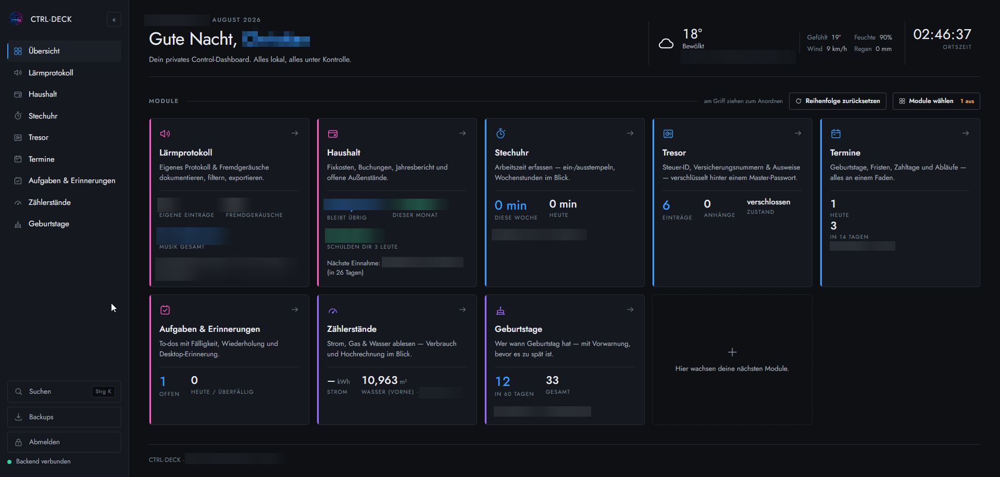
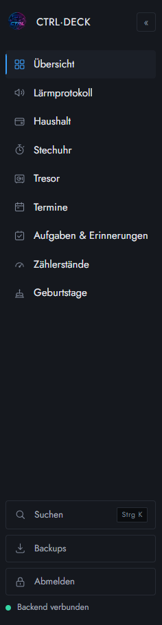

# CTRL·DECK

Ein modulares Control-Dashboard für den eigenen Haushalt — Fixkosten, Arbeitszeit,
Zählerstände, Termine, Dokumentnummern. **Läuft komplett auf deinem Rechner.**
Kein Konto bei irgendwem, kein API-Schlüssel, keine Telemetrie. Die Daten liegen
in einer SQLite-Datei neben dem Programm und gehen nirgendwo hin.



## Warum

Für jede dieser Aufgaben gibt es eine App, und jede will ein Konto, ein Abo und
die Daten auf ihrem Server. CTRL·DECK ist der Gegenentwurf: eine Oberfläche,
neun Module, eine Datei. Wer es nicht mehr will, löscht den Ordner.

## Module

| Modul | Was es tut |
|---|---|
| **Haushalt** | Fixkosten, Buchungen, Jahresbericht und offene Außenstände. Verträge mit Kündigungsfrist warnen rechtzeitig. |
| **Termine** | Geburtstage, Fristen, Zahltage und Abläufe — alles an einem Faden. |
| **Aufgaben & Erinnerungen** | To-dos mit Fälligkeit, Wiederholung und Desktop-Benachrichtigung. |
| **Stechuhr** | Arbeitszeit erfassen — ein-/ausstempeln, Wochenstunden im Blick. |
| **Zählerstände** | Strom, Gas & Wasser ablesen — Verbrauch und Hochrechnung. |
| **Fahrzeug** | HU, Versicherung und Steuer im Blick — dazu Tanken, Wartung und Verbrauch. |
| **Lärmprotokoll** | Störungen dokumentieren, filtern, auswerten — als Bericht zum Drucken oder als PDF sichern. |
| **Geburtstage** | Wer wann Geburtstag hat, mit Vorwarnung. |
| **Tresor** | Steuer-ID, Versicherungsnummern & Ausweise — im Browser verschlüsselt hinter einem Master-Passwort. |

Dazu im Gerüst: Wetter, globale Suche (`Strg`+`K`), Backups, ein- und
ausblendbare Module, freie Reihenfolge per Ziehen.



## Loslegen

Voraussetzung: **Node.js 22.5 oder neuer** (davor gibt es `node:sqlite` nicht).

Unter Windows: Doppelklick auf **`start.cmd`** — installiert beim ersten Mal
alles und öffnet den Browser.

Sonst:

```bash
npm run install:all   # einmalig
npm run dev           # Server + Oberfläche starten
```

- Oberfläche: http://localhost:5180
- Backend-API: http://localhost:8787

Beim ersten Aufruf im Browser läuft die **Ersteinrichtung**: Benutzername,
Passwort und der Ort für die Wetteranzeige. Danach ist alles hinter der
Anmeldung. Ein Passwort vergessen? `npm run passwort-neu`.

## Deine Daten

- Alles liegt in `data/ctrl-deck.db` — eine einzige SQLite-Datei.
- Der Server ruft von sich aus **genau einen** fremden Dienst auf:
  [Open-Meteo](https://open-meteo.com) für das Wetter, ohne Schlüssel und ohne
  Anmeldung. Wer keinen Ort einstellt, spricht mit gar niemandem.
- Der **Tresor** verschlüsselt im Browser (AES-256-GCM, Schlüssel aus dem
  Master-Passwort). Der Server bekommt nur Kauderwelsch zu sehen und kann die
  Inhalte selbst dann nicht lesen, wenn jemand die Datenbank stiehlt.
- Automatische Sicherungen landen in `data/backups/`, auf Wunsch zusätzlich auf
  einer externen Platte.

Der gesamte `data/`-Ordner ist von der Versionsverwaltung ausgenommen.

## Im Netzwerk oder auf einem Server betreiben

Voreingestellt lauscht der Server **nur auf dem eigenen Rechner** (`127.0.0.1`)
und spricht `http`. Das ist für den Alltag richtig: Die Daten verlassen die
Maschine nie, und `http://localhost` gilt im Browser ohnehin als sicherer
Kontext. HTTPS bringt in dieser Betriebsart **nichts**.

Sobald CTRL·DECK von einem anderen Gerät erreichbar sein soll, gilt:

> **Zuerst das Passwort setzen, dann freigeben.** Beim ersten Start im Browser
> die Ersteinrichtung durchlaufen. Ohne Konto ist zwar alles verschlossen —
> aber wer als Erster die Adresse aufruft, richtet sich das Konto ein.

### Variante A — eigenes Gerät im WLAN (empfohlen: Tailscale)

Für „ich will vom Handy draufschauen" ist ein eigenes Zertifikat der
umständlichste Weg. Ein WireGuard-Netz wie Tailscale verschlüsselt die
Verbindung eine Ebene tiefer: keine Browser-Warnung, kein offener Port im
Router, funktioniert auch von unterwegs.

```bash
HOST=0.0.0.0 npm run dev      # oder: npm --prefix server start
```

Tailscale stellt auf Wunsch sogar ein echtes Zertifikat für den Gerätenamen
aus (`tailscale cert`) — das lässt sich dann wie in Variante C einbinden.

### Variante B — Reverse Proxy mit echtem Zertifikat

Der übliche Weg für einen dauerhaft laufenden Server. Der Proxy kümmert sich um
das Zertifikat, CTRL·DECK spricht intern weiter `http`:

```bash
npm run build                                  # Oberfläche bauen (einmalig)
HOST=127.0.0.1 TRUST_PROXY=1 npm --prefix server start
```

`Caddyfile` — mehr ist es nicht, das Zertifikat holt Caddy selbst:

```
deck.example.org {
    reverse_proxy 127.0.0.1:8787
}
```

**`TRUST_PROXY` nicht vergessen.** Ohne die Angabe hält der Server jede Anfrage
für unverschlüsselt (das Sitzungs-Cookie bekommt dann kein `Secure`) und sieht
als Absender immer den Proxy — womit die Bremse gegen das Durchprobieren von
Passwörtern alle Aufrufer in einen Topf wirft.

### Variante C — Zertifikat direkt im Server

Ohne Proxy, wenn schon ein Zertifikat vorliegt (Tailscale, Let's Encrypt,
firmeneigene Stelle). Entweder `data/tls/cert.pem` + `data/tls/key.pem`
hinlegen oder:

```bash
TLS_CERT=/pfad/cert.pem TLS_KEY=/pfad/key.pem HOST=0.0.0.0 npm --prefix server start
```

Ist nur eines von beiden da, **bricht der Start ab** statt still auf `http`
zurückzufallen — zu glauben, verschlüsselt zu senden, ist schlimmer als es
nicht zu tun.

### Selbstsignierte Zertifikate

Bewusst nicht eingebaut. Sie verschlüsseln zwar, aber jedes Gerät zeigt eine
Warnung, und die wegzuklicken wird zur Gewohnheit — die dann auch dort greift,
wo die Warnung berechtigt ist.

### Umgebungsvariablen

| Variable | Standard | Wofür |
|---|---|---|
| `PORT` | `8787` | Port des Servers |
| `HOST` | `127.0.0.1` | `0.0.0.0` macht ihn im Netz erreichbar |
| `TRUST_PROXY` | *(aus)* | Anzahl der Proxys (meist `1`) oder `loopback` |
| `TLS_CERT` / `TLS_KEY` | `data/tls/…` | Zertifikat für direktes HTTPS |
| `ORIGIN` | — | zusätzliche erlaubte Herkunft für CORS, z. B. `https://deck.example.org` |

Liegt eine gebaute Oberfläche unter `web/dist`, liefert der Server sie gleich
mit aus — dann läuft alles unter einer Adresse und CORS entfällt.

## Aufbau

```
ctrl-deck/
├─ server/   Express + SQLite (node:sqlite, kein nativer Build)
│   └─ src/modules/   je Feature ein Backend-Modul
├─ web/      React + Vite (TypeScript)
│   ├─ src/core/      Dashboard-Gerüst, Modul-Registry, Startseite
│   └─ src/modules/   je Feature ein Frontend-Modul
└─ data/     ctrl-deck.db  +  backups/  +  exports/
```

### Ein neues Modul hinzufügen

1. Backend: Router unter `server/src/modules/<name>.ts` anlegen und in
   `server/src/modules/index.ts` in `serverModules` eintragen.
2. Frontend: Ordner `web/src/modules/<name>/` anlegen und das Modul in
   `web/src/core/modules.tsx` in `dashboardModules` eintragen.

Der Kern muss dafür nicht angefasst werden.

### Gestaltung

Die Oberfläche hat ein eigenes, bewusst enges Design-System — flache
undurchsichtige Flächen, Haarlinien statt Schatten, kleine Radien, Farbe nur
dort, wo sie etwas bedeutet, Bewegung nur, wo sie eine Frage beantwortet. Die
verbindlichen Regeln stehen als Kommentarblock oben in
`web/src/core/theme.css`. Wer beiträgt: bitte dort zuerst lesen.

## Technik

| Schicht | Technik |
|---|---|
| Oberfläche | React 18 + Vite + TypeScript |
| Backend | Node 22 + Express |
| Speicher | SQLite (`node:sqlite`, eingebaut — kein nativer Build) |
| Verschlüsselung | Web Crypto (AES-256-GCM, PBKDF2) |
| Export | TXT + druckfertiger Bericht (PDF über den Browser) |

Keine Datenbank-Bibliothek, kein ORM, kein CSS-Framework, keine
Komponentenbibliothek, kein Zustands-Framework.

## Lizenz

Copyright (C) 2026 ProfDuebbi

Dieses Programm ist freie Software: Du kannst es weitergeben und/oder ändern,
unter den Bedingungen der [GNU Affero General Public License](LICENSE), Version 3
oder (nach deiner Wahl) jeder späteren Version, veröffentlicht von der Free
Software Foundation. Es wird in der Hoffnung weitergegeben, dass es nützlich
ist, aber **ohne jede Gewährleistung** — sogar ohne die implizite Garantie der
Marktreife oder der Eignung für einen bestimmten Zweck.

Kurz gesagt: Du darfst das Programm benutzen, ändern und weitergeben. Wenn du
eine geänderte Fassung als Dienst über ein Netzwerk anbietest, musst du deinen
Quelltext den Nutzern dieses Dienstes zugänglich machen. Wer es einfach nur zu
Hause laufen lässt, muss gar nichts tun.
